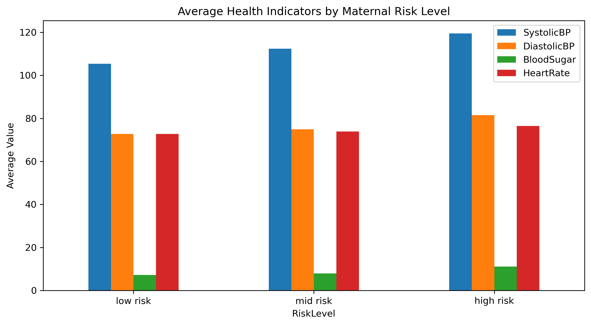
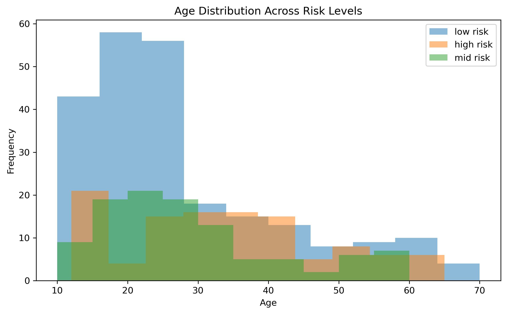
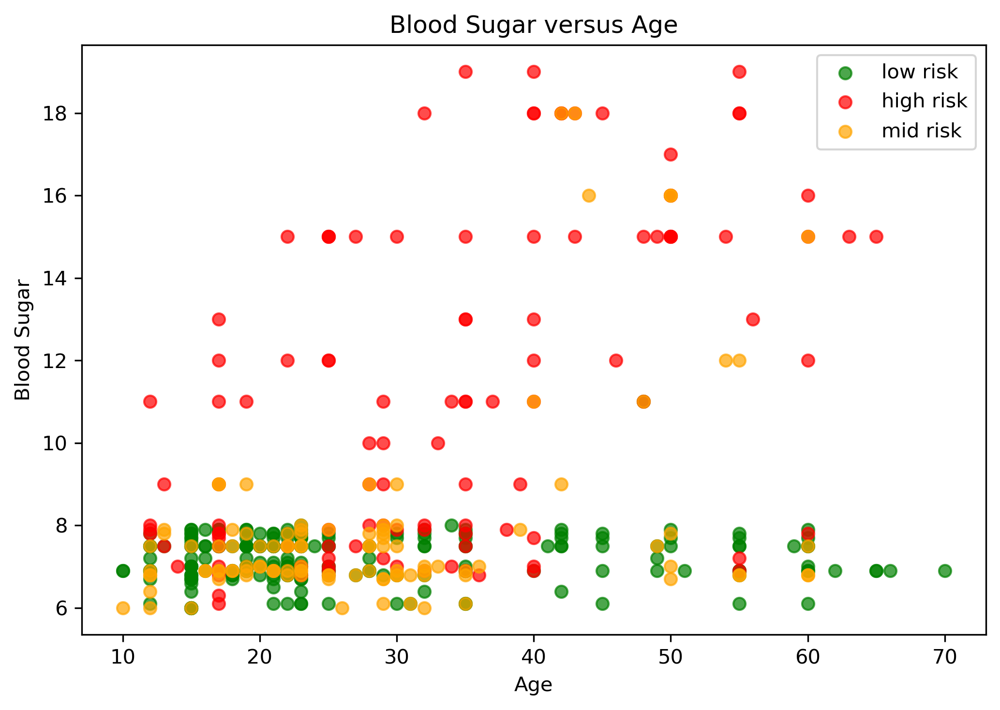
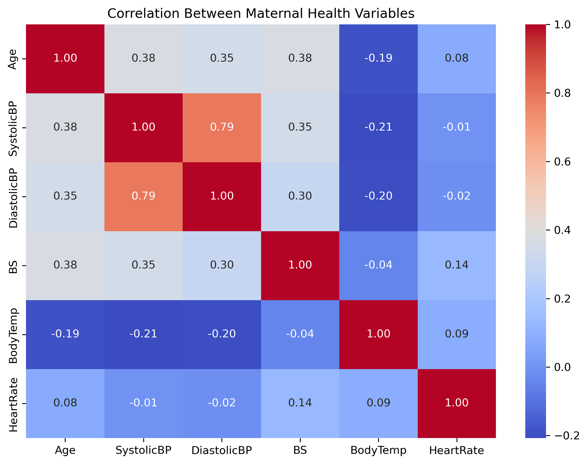
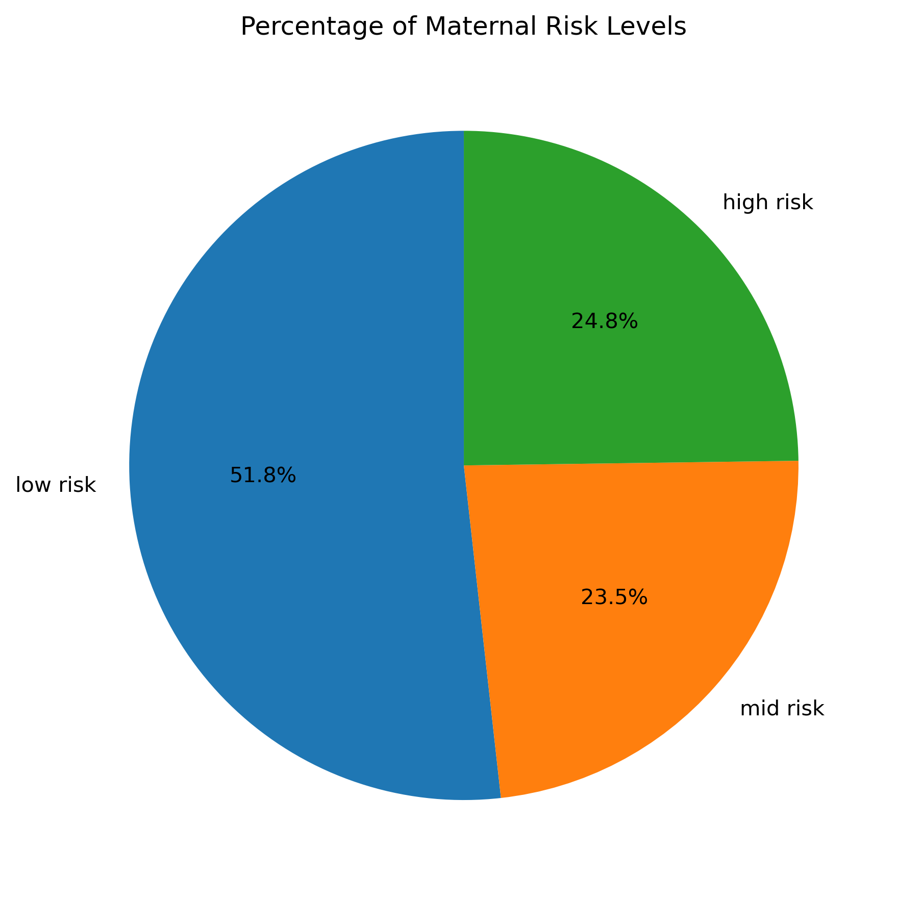
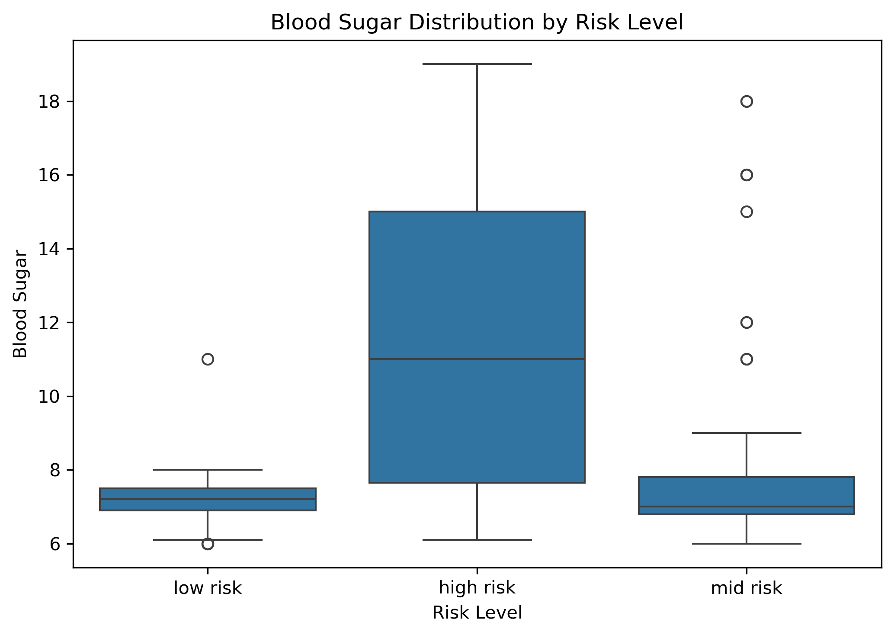

## Project Information:
- **Course**: STQD6324 Data Management
- **Student Name**: Mahani binti Mohamad Zaki  
- **Lecturer**: Dr. Bernard Lee Kok Bang

---

## Project Overview
**Maternal Health Risk Anaysis using Apache Spark & Apache Hive**

This project analyzes maternal health risk factors using Apache Spark, Apache Hive, and Python. The objective is to identify patterns associated with pregnancy risk levels through data cleaning, exploratory data analysis, SQL-based analytics, and data visualization.

The project demonstrates data management skills applicable in healthcare analytics while showcasing the use of distributed data processing technologies.

---

## Industry
Healthcare Analytics

---

## Dataset
- **Dataset**: Maternal Health Risk Dataset
- **Source**: UCI Machine Learning Repository
- **Number of Records**: 1014
- **Number of Features**: 7

| Feature | Description |
|---------|-------------|
| Age | Mother's age |
| SystolicBP | Systolic Blood Pressure |
| DiastolicBP | Diastolic Blood Pressure |
| BS | Blood Sugar |
| BodyTemp | Body Temperature |
| HeartRate | Heart Rate |
| RiskLevel | Low, Mid, High Risk |

---

## Project Overflow
**Raw Dataset**  
⬇️  
**Data Cleaning**  
⬇️  
**Apache Hive Storage**  
⬇️  
**Spark SQL Queries**  
⬇️  
**Data Visualization**  
⬇️  
**Insights**  
⬇️  
**Recommendations**  
⬇️  
**Conclusion**

---

## Tools Used
- Python
- Apache Spark
- PySpark
- Apache Hive
- Pandas
- Matplotlib
- Seaborn
- Jupyter Notebook

---

## Data Cleaning
The following preprocessing steps were performed:
- Checked missing values
- Removed duplicate records
- Verified data types
- Checked invalid values
- Renamed columns
- Generated descriptive statistics

---

## Data Visualizations
The project includes multiple visualizations to understand maternal health characteristics.

### 1. Average Health Indicators by Risk Level

### 2. Age Distribution by Risk Level

### 3. Blood Sugar vs Age

### 4. Correlation heatmap

### 5. Percentage of Mothers by Risk Level

### 6. Boxplot of Blood Sugar by Risk Level

---

## Insight and Explanations
The exploratory analysis revealed several important patterns in the maternal health dataset:

* **Risk Distribution:** Most mothers fall into the low and mid-risk categories, while the high-risk group represents a smaller proportion of the dataset.
* **Age:** Higher maternal age is generally associated with an increased pregnancy risk, although age alone is not a definitive predictor.
* **Blood Pressure:** Both systolic and diastolic blood pressure tend to increase as the maternal risk level rises, indicating that hypertension is an important risk factor.
* **Blood Sugar (BS):** High-risk mothers consistently exhibit higher blood sugar levels, making blood sugar one of the strongest indicators of maternal health risk.
* **Body Temperature:** Body temperature remains relatively stable across all risk groups, suggesting that it has a weaker relationship with pregnancy risk.
* **Heart Rate:** Heart rate varies only slightly among different risk levels and appears to have less influence compared to blood pressure and blood sugar.

Overall, blood pressure and blood sugar are the most significant health indicators associated with higher maternal risk levels, highlighting the importance of regular monitoring during pregnancy.

---

## Recommendation
Based on the analysis, the following recommendations are proposed:

Encourage regular monitoring of blood pressure and blood sugar throughout pregnancy to support early detection of high-risk cases.
Promote routine maternal health screenings to identify potential complications before they become severe.
Educate expectant mothers on maintaining a healthy lifestyle through balanced nutrition, regular physical activity, and consistent prenatal care.
Healthcare providers should prioritize mothers with abnormal blood pressure or blood sugar readings for closer monitoring and timely intervention.
Future studies can incorporate larger datasets and machine learning models to improve maternal risk prediction and support clinical decision-making.

---

## Conclusion
This project demonstrates how Apache Spark, Apache Hive, and Python can be used to manage, analyze, and visualize maternal health data effectively. Through data cleaning, SQL-based analysis, and visualization, the study identified blood pressure and blood sugar as the most influential factors associated with maternal health risk. The findings provide valuable insights that can support healthcare professionals in identifying high-risk pregnancies and emphasize the importance of early monitoring and preventive healthcare practices.

---

